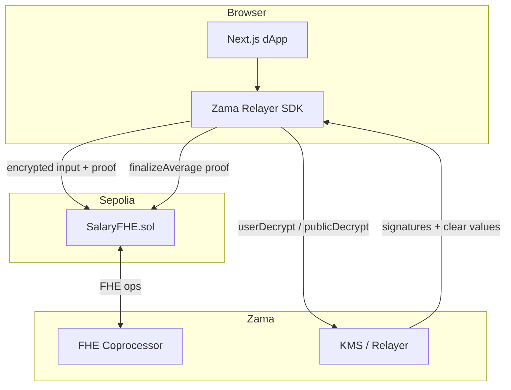

# ASB — Anonymous Salary Benchmark

**Confidential salary benchmarking on Zama FHEVM (Ethereum Sepolia)**

ASB lets individuals compare compensation against market averages **without ever exposing clear-text salaries on-chain**. Salaries are encrypted in the browser, aggregated homomorphically in Solidity, and compared via private decryption — only the submitter learns their result.

Built for the [Zama Developer Program — Builder Track](https://www.zama.org/post/zama-developer-program-mainnet-season-3-composable-privacy-is-the-key).

[](https://soliditylang.org/)
[](https://hardhat.org/)
[](https://docs.zama.ai/fhevm)
[](https://nextjs.org/)
[](https://sepolia.etherscan.io/address/0xb452901e6C5231e8c15Feda1294143d48574325B)
[](LICENSE)

---

## Table of contents

- [Why ASB exists](#why-asb-exists)
- [Key features](#key-features)
- [Live deployment](#live-deployment)
- [Architecture](#architecture)
- [Privacy model](#privacy-model)
- [Tech stack](#tech-stack)
- [Repository structure](#repository-structure)
- [Prerequisites](#prerequisites)
- [Quick start](#quick-start)
- [Environment variables](#environment-variables)
- [Smart contract](#smart-contract)
- [Running tests](#running-tests)
- [Deploy to Sepolia](#deploy-to-sepolia)
- [Explore](#explore-explore)
- [Frontend notes](#frontend-notes)
- [User flows](#user-flows)
- [Documentation](#documentation)
- [Security and limitations](#security-and-limitations)
- [Roadmap](#roadmap)
- [License](#license)
- [Author](#author)

---

## Why ASB exists

Traditional salary surveys (Glassdoor, Levels.fyi, internal HR spreadsheets) require trusting a central party with your exact compensation. Even when only averages are published, raw submissions often sit in databases and small samples enable inference attacks.

ASB inverts that model:

1. **Encrypt locally** — salary never leaves the browser in clear text.
2. **Compute on ciphertexts** — the contract sums, divides, and compares using FHE.
3. **Release averages at tier boundaries** — public numbers appear only at 5, 10, 15… participants (k-anonymity).
4. **Private comparisons** — each user decrypts a single bit: above or below the live pool average.

Use cases: individual market positioning and transparent category averages without doxxing contributors.

---

## Key features

| Feature | Description |
|--------|-------------|
| **Encrypted submission** | `euint64` salaries encrypted via `@zama-fhe/relayer-sdk` before tx broadcast |
| **k-anonymity (k ≥ 5)** | No averages or benchmarks until five participants share a category |
| **Tiered public release** | Snapshots at 5, 10, 15… with KMS-verified `finalizeAverage` |
| **Live private compare** | `FHE.gt(yourSalary, poolAverage)` — user-decryptable only by submitter |
| **Rich categories** | 35 roles × 55 cities × 6 seniority levels |
| **Explore dashboard** | Live pool health, tier trends, and on-chain event discovery |
| **Sepolia seed tooling** | One-command demo data: 10 categories × 10 wallets + tier publish + manifest sync |
| **No backend** | Wallet + relayer + contract only; no salary database |

---

## Live deployment

| Resource | Link |
|----------|------|
| **Network** | Ethereum Sepolia (chain ID `11155111`) |
| **Contract** | [`0xb452901e6C5231e8c15Feda1294143d48574325B`](https://sepolia.etherscan.io/address/0xb452901e6C5231e8c15Feda1294143d48574325B) |
| **Frontend** | Run locally (`npm run web:dev`) or deploy `packages/web` to Vercel |
| **Explore** | `/explore` — pools, tier trends, and event-discovered categories |
| **Docs** | `/how-it-works/overview` — in-app guide (9 sections) |

---

## Architecture



**Data flow (individual):**

1. User selects category (position, city, seniority) and enters USD salary.
2. Relayer SDK encrypts to `externalEuint64` + input proof.
3. `submitSalary` ingests via `FHE.fromExternal`, homomorphically adds to category sum.
4. After k ≥ 5, live encrypted average is computed; user calls `compareToAverage`.
5. Optional: anyone triggers tier public release (request → decrypt → finalize).

---

## Privacy model

### Stays private

- Exact salary (ciphertext handles only on-chain)
- Personal comparison result (one `ebool`, ACL-granted to submitter)

### Public on-chain

- Wallet addresses and transaction metadata
- Participant count per category
- Finalized tier snapshot averages (after three-step public decrypt)
- Events: `SalarySubmitted`, `AverageFinalized`, etc.

### Design choices

- **Tier snapshots** at round boundaries (5, 10, 15…) mitigate differential leakage from publishing after every new join.
- **Private comparisons** always use the **live** encrypted pool average, not the published tier snapshot.
- **One submission per wallet** for individuals prevents category skewing.

---

## Tech stack

| Layer | Technology |
|-------|------------|
| FHE contracts | Solidity `^0.8.28`, `@fhevm/solidity@0.11.1`, `ZamaEthereumConfig` |
| Toolchain | Hardhat `^2.28`, `@fhevm/hardhat-plugin@0.4.2`, `@fhevm/mock-utils@0.4.2` |
| Frontend | Next.js 15, React 19, Tailwind CSS 4 |
| Wallet | wagmi, RainbowKit, viem |
| Encryption | `@zama-fhe/relayer-sdk@0.4.1` (pinned) |
| Network | Ethereum Sepolia (`11155111`) |

---

## Repository structure

```
FheSalary/
├── packages/
│   ├── contracts/
│   │   ├── contracts/
│   │   │   ├── SalaryFHE.sol          # Main FHEVM contract
│   │   │   └── lib/Categories.sol     # Category dimensions + k threshold
│   │   ├── test/SalaryFHE.test.ts     # Hardhat + mock FHE tests
│   │   ├── scripts/
│   │   │   ├── deploy.ts              # Deploy + ABI sync + .env.local update
│   │   │   ├── seed-data.ts           # Demo category labels + salary spreads
│   │   │   └── seed-categories.ts     # Sepolia seed runner (10×10 wallets)
│   │   └── deployments/sepolia.json
│   └── web/
│       ├── src/
│       │   ├── app/                   # Next.js routes (/, /app, /explore, /how-it-works/*)
│       │   ├── components/            # UI, docs sidebar, Explore cards, SVG icons
│       │   ├── context/               # FhevmProvider (SDK preload on boot)
│       │   ├── data/                  # seed-manifest.json (demo pool metadata)
│       │   ├── hooks/                 # useSalaryFhe, useExplorePools, useDiscoveredCategoryIds
│       │   ├── lib/                   # contract, categories, category-registry, seed-manifest, how-it-works-content
│       │   └── abi/                   # Generated ABI + deployment.json (address fallback)
│       └── public/                    # Logo assets
├── .env.example
└── package.json                       # npm workspaces root
```

---

## Prerequisites

- **Node.js** ≥ 18 (20+ recommended)
- **npm** ≥ 9
- A **Sepolia-funded wallet** for deploy and on-chain interactions
- **WalletConnect project ID** (optional; MetaMask works without it)
- **Etherscan API key** (optional; for contract verification)

---

## Quick start

```bash
# 1. Clone and install
git clone https://github.com/deusdotdev/AnonymousSalaryBenchmark.git
cd AnonymousSalaryBenchmark
npm install

# 2. Configure environment (see below)
cp .env.example .env
cp .env.example packages/web/.env.local
# Edit both files with your keys and contract address

# 3. Compile and test contracts
npm run contracts:compile
npm run contracts:test

# 4. Start the frontend
npm run web:dev
```

Open [http://localhost:3000](http://localhost:3000), connect a Sepolia wallet, and navigate to **Launch app**.

**Already deployed contract?** The web app falls back to `packages/web/src/abi/deployment.json` when `NEXT_PUBLIC_SALARY_FHE_ADDRESS` is unset — no extra env required for read-only Explore.

---

## Environment variables

### Root `.env` (contracts / deploy)

| Variable | Required | Description |
|----------|----------|-------------|
| `PRIVATE_KEY` | Deploy only | Deployer wallet private key |
| `RPC_URL` | Deploy only | Sepolia RPC endpoint |
| `ETHERSCAN_API_KEY` | Verify only | Etherscan API key for verification |

### `packages/web/.env.local` (frontend)

| Variable | Required | Description |
|----------|----------|-------------|
| `NEXT_PUBLIC_SALARY_FHE_ADDRESS` | No* | Deployed `SalaryFHE` address |
| `NEXT_PUBLIC_WALLETCONNECT_PROJECT_ID` | No | Enables WalletConnect in RainbowKit |
| `NEXT_PUBLIC_SEPOLIA_RPC_URL` | No | Custom Sepolia RPC (defaults to public node) |

\* If unset, the frontend falls back to `packages/web/src/abi/deployment.json` (synced on deploy). Vercel builds work without setting the env var when that file is committed.

The deploy script automatically updates `NEXT_PUBLIC_SALARY_FHE_ADDRESS` in `.env.local` after a successful Sepolia deploy.

---

## Smart contract

**Contract:** `SalaryFHE`  
**Base:** `ZamaEthereumConfig` (FHEVM v0.11)

### Core functions

| Function | Caller | Purpose |
|----------|--------|---------|
| `submitSalary(position, city, seniority, enc, proof)` | Individual | One-time encrypted salary submission |
| `compareToAverage()` | Individual | Homomorphic compare vs live pool; grants user-decryptable `ebool` |
| `requestAverageRelease(categoryId, tier)` | Anyone | Step 1 of public tier release |
| `finalizeAverage(categoryId, tier, clearAvg, proof)` | Anyone | Step 3: verify KMS proof, store clear average |

Company-facing functions (`submitCompanySalary`, `computeCompanyComparison`) exist on the deployed contract but are **not exposed in the web UI** — planned for a future release (see [Roadmap](#roadmap)).

### View helpers

`getBucketCount`, `isAverageComputed`, `getClearAverage`, `isTierFinalized`, `getLatestFinalizedTier`, `computeCategoryId`, and handle getters for decryption flows.

### Categories

```solidity
categoryId = keccak256(abi.encode(positionId, cityId, seniorityId))
```

- **35** positions, **55** cities, **6** seniority levels  
- **MIN_PARTICIPANTS = 5** for averages and benchmarks  
- Tier publish only at multiples of 5 (5, 10, 15, …)

---

## Running tests

```bash
npm run contracts:test
```

**12 tests** covering:

- Duplicate submission rejection
- Encrypted average after five participants
- Private above/below comparison (`FHE.gt`)
- Tier-5 and tier-10 public release (full three-step flow)
- Invalid tier rejection (e.g. count = 7)
- Live compare still works after tier publish
- Category ID hash parity with frontend (`viem` keccak256)
- Out-of-range category indices

All tests use `@fhevm/mock-utils` via the Hardhat FHEVM plugin.

---

## Deploy to Sepolia

```bash
# From repo root — ensure .env has PRIVATE_KEY and RPC_URL
npm run deploy:sepolia -w @fhesalary/contracts
```

This will:

1. Deploy `SalaryFHE` to Sepolia
2. Write `packages/contracts/deployments/sepolia.json`
3. Copy ABI to `packages/web/src/abi/SalaryFHE.json`
4. Update `NEXT_PUBLIC_SALARY_FHE_ADDRESS` in `packages/web/.env.local`

### Verify on Etherscan (optional)

```bash
cd packages/contracts
npx hardhat verify --network sepolia <CONTRACT_ADDRESS>
```

### Seed demo data (optional)

Populates **10 categories × 10 wallets** on Sepolia for Explore / dashboard demos. Wallets are derived deterministically from `PRIVATE_KEY` (indices 0–99); each wallet submits once in its category.

**Requirements:** deployer needs roughly **1.85 Sepolia ETH** (FHE `submitSalary` txs are gas-heavy). Default **8 parallel** submissions (`SEED_CONCURRENCY=8`); increase cautiously if the RPC/relayer rate-limits.

```bash
# From repo root
npm run seed:sepolia -w @fhesalary/contracts
```

The script:

1. Derives 100 child wallets from `.env` `PRIVATE_KEY`
2. Funds each wallet (~0.018 ETH)
3. Encrypts salaries via `@zama-fhe/relayer-sdk/node` and calls `submitSalary`
4. Publishes tier-5 and tier-10 public averages per category
5. Writes `packages/web/src/data/seed-manifest.json` for the frontend

Category labels and salary spreads live in `packages/contracts/scripts/seed-data.ts`. Re-runs skip wallets that already submitted.

---

## Explore (`/explore`)

The Explore page surfaces pool activity without a backend:

| View | What it shows |
|------|----------------|
| **Pools** | Live badge, participant counts, published tier averages, fill progress |
| **Trends** | Tier-to-tier delta (e.g. avg at 5 vs 10 participants) with a sparkline chart |

**Data sources (merged in the browser):**

1. **`seed-manifest.json`** — curated demo categories (always listed, even at 0 participants).
2. **Event logs** — `SalarySubmitted` (and legacy `CompanySalarySubmitted`) scanned via `getLogs`; active categories are merged into Explore.
3. **Live reads** — `getBucketCount`, `isTierFinalized`, `getClearAverage` override manifest fallbacks when RPC is connected.

Event discovery refetches about every 60 seconds. Labels for discovered categories are resolved from the full position × city × seniority registry (`category-registry.ts`).

---

## Frontend notes

- **FHE SDK preload** — `FhevmProvider` warms the relayer SDK chunk at app boot so the first encrypt/submit is faster.
- **Contract address** — env var first, then `deployment.json` (see [Environment variables](#environment-variables)).
- **Docs pages** — static how-it-works routes use plain links (no RainbowKit vendor chunk on doc SSR).
- **COOP** — FHE WASM needs `Cross-Origin-Opener-Policy: same-origin` (`next.config.ts`). Coinbase Wallet is excluded due to COOP conflict.

---

## User flows

### Individuals (`/app`)

1. Connect wallet (Sepolia).
2. Select position, city, seniority; enter annual USD salary.
3. SDK encrypts locally → `submitSalary` transaction.
4. Track category progress (participants / next tier).
5. After k ≥ 5: **Compare my salary privately** → decrypt above/below bit.
6. Optional: **Publish tier N average** (public three-step flow).

### Explore (`/explore`)

1. Open **Explore** from the nav or landing page.
2. **Pools** tab — participant counts, published tier averages, and live pool badges.
3. **Trends** tab — categories with both tier-5 and tier-10 published averages, sorted by largest % move.
4. Click **Open in benchmark app** to jump to `/app` with that category pre-selected.

---

## Documentation

In-app docs (sidebar with section anchors):

| Page | Route |
|------|-------|
| Overview | `/how-it-works/overview` |
| Architecture | `/how-it-works/architecture` |
| Core concepts | `/how-it-works/concepts` |
| Individual flow | `/how-it-works/individual-flow` |
| Public tier release | `/how-it-works/public-release` |
| Privacy model | `/how-it-works/privacy` |
| Trust & verification | `/how-it-works/trust` |
| Explore & trends | `/how-it-works/explore` |
| FAQ | `/how-it-works/faq` |

External references:

- [Zama FHEVM docs](https://docs.zama.ai/fhevm)
- [Zama Protocol](https://docs.zama.org/protocol)
- [Relayer SDK](https://docs.zama.ai/protocol/relayer-sdk)

---

## Security and limitations

- **Testnet demo** — Sepolia deployment; not audited for mainnet production use.
- **Wallet linkage** — addresses are public; protocol does not link wallet to clear salary, but on-chain activity is visible.
- **Sparse categories** — low-participant pools stay locked; averages may never unlock for niche combos.
- **Tier snapshots** — public averages are historical cohort snapshots, not real-time leaks.
- **Browser requirements** — FHE WASM needs `Cross-Origin-Opener-Policy: same-origin` (configured in `next.config.ts`). Coinbase Wallet is excluded due to COOP conflict.
- **Relayer dependency** — encryption/decryption requires Zama relayer availability.
- **Explore RPC load** — event scan + per-pool contract reads can be heavy on public Sepolia RPC; use a dedicated RPC for production demos.

Report issues responsibly via GitHub Issues.

---

## Roadmap

- **Company benchmark UI** — `/company` flow for encrypted payroll vs market (contract functions already on Sepolia)
- Security audit, then mainnet deployment
- Encrypted percentile bands (range comparison without revealing salary)
- Trust UI — verify contract and deployment from the app
- Turkish UI

---

## License

This project is licensed under the [MIT License](LICENSE).

---

## Author

**built by [ex_machinam](https://x.com/ex_machinam)**

---

<p align="center">
  <sub>ASB · Anonymous Salary Benchmark · Powered by Zama FHEVM</sub>
</p>
